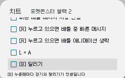

# 치트 (Cheats)
Pico Launcher는 `/_pico/usrcheat.dat` 에 위치한 파일의 치트를 지원합니다. 해당 파일에는 치트 코드와 어떤 치트가 활성화되었는지에 대한 정보가 저장됩니다. 치트가 활성화된 게임을 실행하면, 활성화된 치트 내역이 Pico Loader로 전달됩니다.

## 사용 방법
사용 가능한 치트 목록을 확인하려면 ROM 브라우저에서 게임을 선택(Highlight)한 후 Y 버튼을 눌러 치트 패널을 여십시오.

### 조작 방법
- 십자키(DPAD) 상/하: 치트 목록 스크롤
- L 및 R 버튼: 치트가 많을 때 빠르게 스크롤
- A 버튼: 치트 활성화/비활성화 전환 또는 치트 카테고리 진입
- B 버튼: 상위 항목으로 이동하거나, 최상위 위치에서 치트 패널 닫기
- Y 버튼: 치트 패널 닫기
- X 버튼: 모든 치트 비활성화