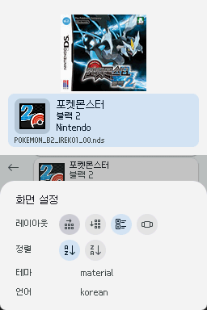

# Pico Launcher 사용법
이 문서는 Pico Launcher의 다양한 설정과 기능에 대해 설명합니다.

## Pico Launcher 인터페이스
Pico Launcher를 실행하면 다음과 같은 화면이 표시됩니다.

이 화면에서 SD 카드를 탐색하여 홈브류 및 게임을 실행할 수 있습니다.

- **십자키(DPAD):** 선택 항목 이동
- **A 버튼:** 폴더 열기, 또는 홈브류 및 게임 실행
- **B 버튼:** 상위 폴더로 이동하거나 메뉴 닫기
- **L 및 R 버튼:** 폴더 내 항목이 많을 때 빠르게 스크롤
- **Y 버튼:** 치트 패널 열기 ([치트](Cheats.md) 참조)

하단 화면 왼쪽 상단에 있는 뒤로 가기 화살표를 눌러서 상위 폴더로 이동할 수도 있습니다.

현재 터치 기능은 아직 지원되지 않으므로 유의해 주시기 바랍니다.

## 설정 메뉴
십자키를 사용하여 선택 항목을 톱니바퀴 아이콘으로 이동한 후 A 버튼을 누르면 설정 메뉴에 진입할 수 있습니다. 설정 메뉴에서 B 버튼을 누르면 파일 브라우저로 돌아갑니다.

레이아웃, 정렬, 테마, 언어를 설정할 수 있습니다. ([settings.json 파일](#설정)을 수정해도 변경할 수 있습니다.) 각 레이아웃의 모습은 다음과 같습니다.

<table>
    <tr>
        <th>가로 그리드</th>
        <th>세로 그리드</th>
        <th>배너 리스트</th>
        <th>커버플로우</th>
    </tr>
    <tr>
        <td></td>
        <td></td>
        <td></td>
        <td></td>
    </tr>
</table>

## 설정
설정 값은 SD 카드의 `/_pico/settings.json`에 저장됩니다. 일반적인 텍스트 편집기로 수정할 수 있으며, 다음 설정 항목들을 사용할 수 있습니다:

- `language` - Pico Launcher의 표시 언어입니다. 비공식 한글패치에서는 `english`, `korean`, `japanese` 언어를 지원합니다.
- `romBrowserLayout` - 폴더 내용이 표시되는 방식을 지정합니다.
- `romBrowserSortMode` - 폴더 내용을 이름 오름차순(`NameAscending`)으로 정렬할지, 내림차순(`NameDescending`)으로 정렬할지 지정합니다.
- `theme` - 사용할 테마의 폴더 이름을 지정합니다. 테마를 찾을 수 없는 경우 기본 테마(Fallback)가 사용됩니다.
- `lastUsedFilePath` - 가장 최근에 실행한 홈브류 또는 게임의 경로를 지정하여, 다음 런처 실행 시 해당 파일이 자동으로 선택되도록 합니다. Pico Launcher에 의해 자동으로 업데이트됩니다.
- `fileAssociations` - 이 설정의 사용법은 [FileAssociations.md](/docs/FileAssociations.md)를 참조해 주십시오.